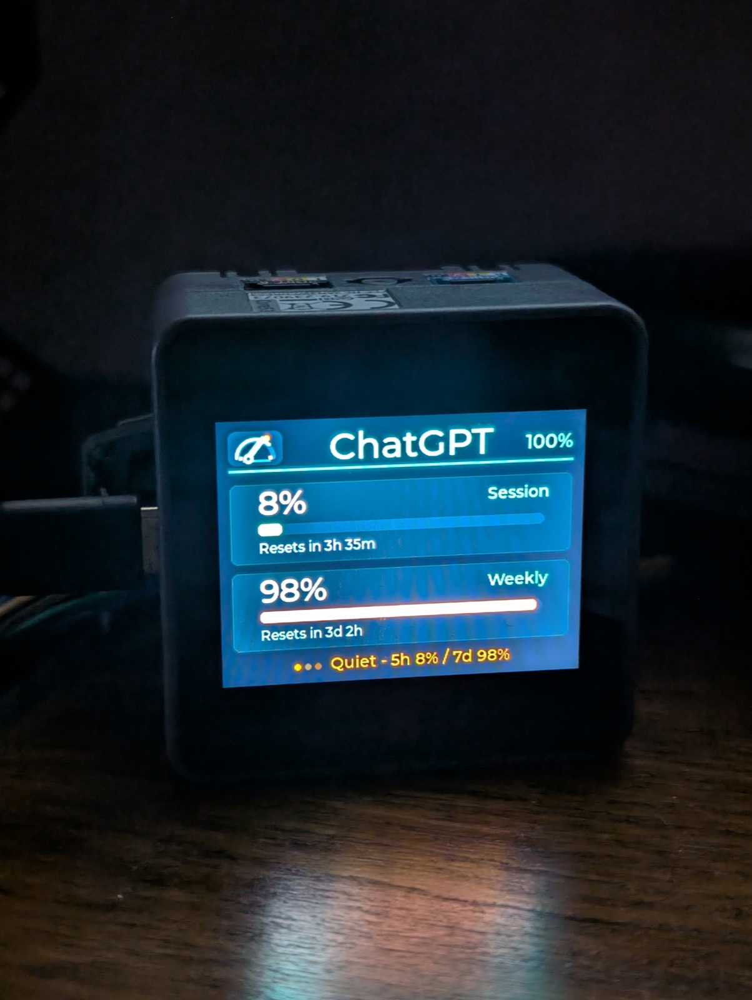
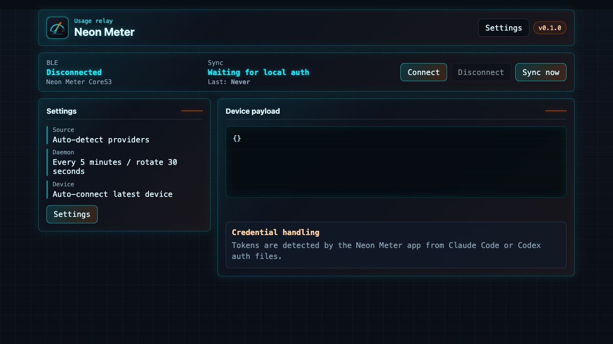
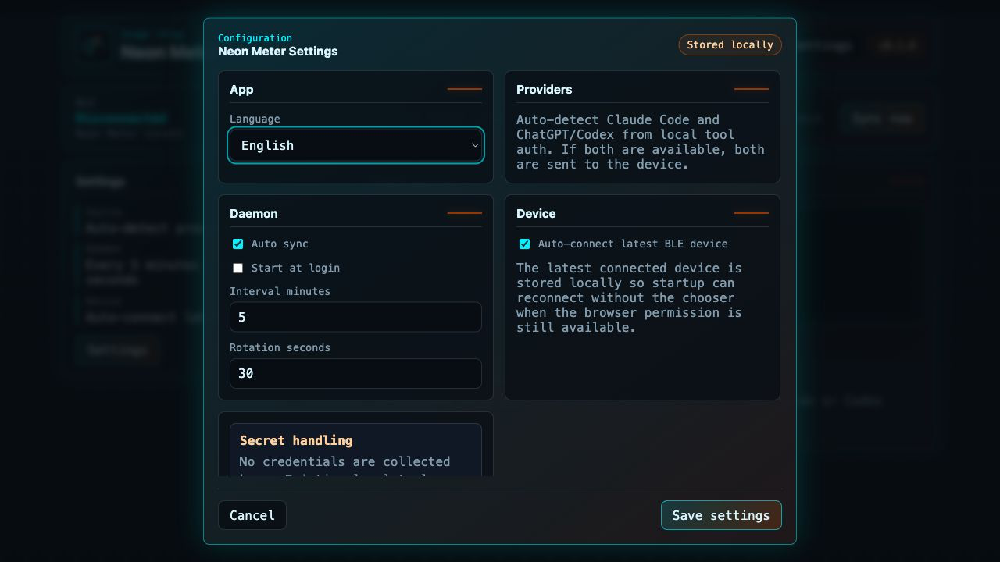
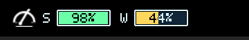

# Neon Meter Host

Desktop host app for showing live AI usage on the Neon Meter CoreS3 device.
It is the companion app for the [SunboX/neon-meter](https://github.com/SunboX/neon-meter)
project.

## Device



## Screenshots







The menu bar quota display is enabled by default and shows remaining Session
(`S`) and Weekly (`W`) capacity for the active provider. Its gauges use the same
remaining-capacity color buckets as the Neon Meter CoreS3 display. You can hide
or show the menu bar gauges from the tray context menu; hiding them only removes
the status-bar display while provider sync and device updates continue.

## Quick Start

```bash
npm install
npm start
```

No credential setup is required in the app. Neon Meter uses credentials already
managed by Claude Code or Codex on the local machine.

## Documentation

- [Getting started](docs/getting-started.md)
- [Architecture](docs/architecture.md)
- [Providers](docs/providers.md)
- [Device transport protocol](docs/ble-protocol.md)
- [Security](docs/security.md)
- [Testing](docs/testing.md)
- [Troubleshooting](docs/troubleshooting.md)
- [Host spec](specs/host-daemon.md)
- [Changelog](CHANGELOG.md)

## License

Neon Meter Host is licensed under the GNU Affero General Public License v3.0 or
later (`AGPL-3.0-or-later`). Documentation and media notices are covered in the
REUSE metadata. See [LICENSE](LICENSE), [NOTICE.md](NOTICE.md), and
[COMMERCIAL-LICENSE.md](COMMERCIAL-LICENSE.md).
